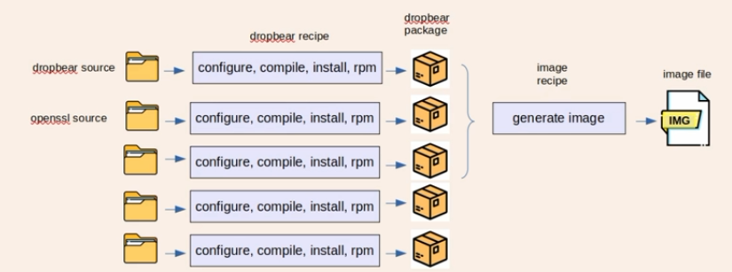
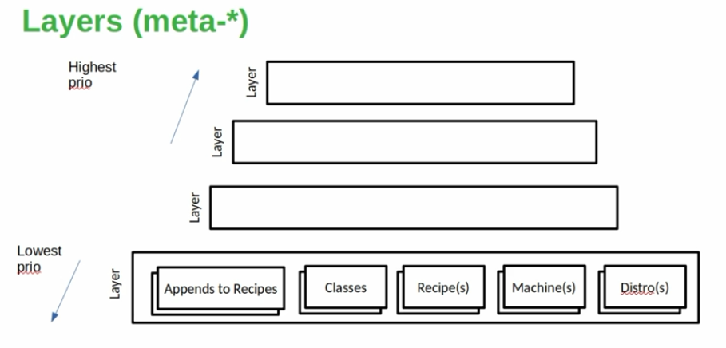
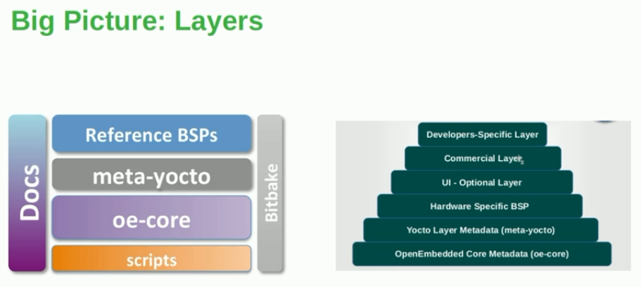

- 
- 
- 

## 1. Add raspberrypi layer:
    - Search meta-.. in `https://layers.openembedded.org/layerindex/branch/master/layers/`
    - `git clone git://git.yoctoproject.org/meta-raspberrypi -b scarthgap`
    - check LAYERDEPENDS
    - find depence layers and install it and add it to `bblayer.conf`
    - Change MACHINE in `/conf/local.conf` into `MACHINE = raspberrypi3-64`

## 2. layer:
    - Append to recipes(.bbappend): override variable, function,...
    - Class (.bbclass):
    - recipe (.bb): method fetch, patch, comiple, configuration,...
    - machine (.conf): config machine 
    - Distro (.conf): config distro
## 3. Create Our Own Layers
    - Copy one layer and rename (meta-custom)
    - Delete all folder in meta-custom except `conf/layer.conf`
    - Inside `meta-custom`
```bash
    # We have a conf and classes directory, append to BBPATH
    BBPATH .= ":${LAYERDIR}"

    # We have a recipes directory containing .bb and .bbappend files, add to BBFILES
    BBFILES += "${LAYERDIR}/recipes*/*/*.bb \
                ${LAYERDIR}/recipes*/*/*.bbappend"

    BBFILE_COLLECTIONS += "custom"
    BBFILE_PATTERN_custom := "^${LAYERDIR}/"
    BBFILE_PRIORITY_custom = "10"

    LAYERSERIES_COMPAT_custom = "nanbield scarthgap"
    LAYERDEPENDS_custom = "core raspberrypi"


    BBFILES += "${@' '.join('${LAYERDIR}/dynamic-layers/%s/recipes*/*/*.bbappend' % layer \
                for layer in BBFILE_COLLECTIONS.split())}"
    BBFILES += "${@' '.join('${LAYERDIR}/dynamic-layers/%s/recipes*/*/*.bb' % layer \
                for layer in BBFILE_COLLECTIONS.split())}"

    BBFILES_DYNAMIC += " \
        openembedded-layer:${LAYERDIR}/dynamic-layers/openembedded-layer/*/*/*.bb \
        openembedded-layer:${LAYERDIR}/dynamic-layers/openembedded-layer/*/*/*.bbappend \
        networking-layer:${LAYERDIR}/dynamic-layers/networking-layer/*/*/*.bb \
        networking-layer:${LAYERDIR}/dynamic-layers/networking-layer/*/*/*.bbappend \
        qt5-layer:${LAYERDIR}/dynamic-layers/qt5-layer/*/*/*.bb \
        qt5-layer:${LAYERDIR}/dynamic-layers/qt5-layer/*/*/*.bbappend \
        multimedia-layer:${LAYERDIR}/dynamic-layers/multimedia-layer/*/*/*.bb \
        multimedia-layer:${LAYERDIR}/dynamic-layers/multimedia-layer/*/*/*.bbappend \
    "
```
- Add package to layer
    - Ex: Add `IMAGE_FEATURES:append = " dropbear "` to `meta-custom/conf/local.conf`
    - Check installed list: `code pn-buildlist`

    