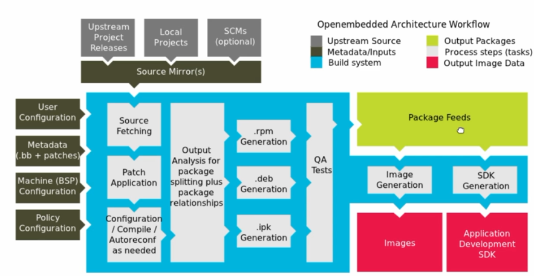
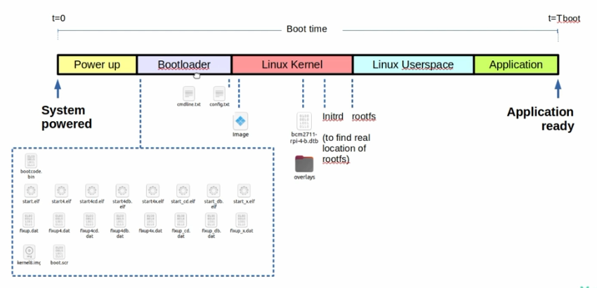

## 1. Architecture

- Source mirror
    - Upstream
    - Local projects
    - SCMs
- Config 
    - **conf/local.conf**
    - **conf/bblayers.conf**
    - meta/your-layer/conf/machine/machine.conf
    - meta/your-layer/conf/distro/distro.conf
    - bitbake.conf
    - meta/your-layer/conf/layer.conf
    - meta/conf/auto.conf
- Source Fetching
- Patch Application
- Configuration/Compile/Autoreconf as needed
## 2. Environment Setup and Downloading Poky Reference Distribution
- Build host package: `sudo apt-get install build-essential chrpath cpio debianutils diffstat file gawk gcc git iputils-ping libacl1 liblz4-tool locales python3 python3-git python3-jinja2 python3-pexpect python3-pip python3-subunit socat texinfo unzip wget xz-utils zstd`
- Use Git to Clone Poky: `git clone git://git.yoctoproject.org/poky -b scarthgap`
- Install extension in VSCode:
    - Code runner
    - Device Tree
    - QML
    - Bash IDE
    - Bitbake
    - vscode-pdf
    - Yocto Project Bitbake
- Find `find . -name "*.txt"`
## 3. Yocto Project Basic Configuration and Examining Poky Source
- Initialize the Build Environment
    - `source oe-init-build-env`
- Operator:
    - `=:` Assigns a value to a variable (overwrites the current value).

    - `+=`: Adds a value to a variable (string or list).

    - `?=`: Assigns a value to a variable only if the variable does not have a value.

    - `??=`: Assigns a value to a variable if the variable does not have a value or has an empty string.

    - `:=`: Assigns an immediate value to a variable, performing the calculation right when assigned.

    - `-=`: Removes an element from a variable (for strings or lists).

- `poky/build/conf`
    - `BBLAYERS`: Lists the layers used in the system.
    - 

## 4. Example in docker
- Dropbear
    - Install
        - `sudo apt install bzip2 bunzip2 chrpath diffstat lz4`
        - `bitbake dropbear`
    - Error:
        - Error: `cmake-native`
        - Solution:
            - `bitbake -c fetchall cmake-native` 
            - `bitbake -c cleansstate cmake-native`
        - `ERROR: quilt-native-0.67-r0 do_fetch: Bitbake Fetcher Error: NetworkAccess('https://download.savannah.gnu.org/releases/quilt/quilt-0.67.tar.gz', "/usr/bin/env wget -t 2 -T 100 -O /home/user/Android/Sdk/yocto/poky/build/downloads/quilt-0.67.tar.gz.tmp -P `
        - Solution
            - `conf/local.conf`: 
            - Add `BB_NO_NETWORK = "0"`
            - Add `CONNECTIVITY_CHECK_URIS = "https://www.yoctoproject.org/connectivity.html"`
            - `sudo nano /etc/resolv.conf`
            - Add `nameserver 8.8.8.8`
            - Add `nameserver 8.8.4.4`
            - Add `nameserver 1.1.1.1`
            - Add `nameserver 1.0.0.1`

## 5. Add package
- Delete and build 
    - `bitbake -c cleansstate dropbear`
- Add dropbear
    - `find . -name "*dropbear"`


## 6. UART 
- PL2303
    - red - 5V
    - black - GND
    - green - TX
    - white - RX
- Raspberry pi 3b+
    - GPIO 14 - TX
    - GPIO 15 - RX
    - GND - 
- Connect the wire:
    - white <-> GPIO 14 (Pi)
    - green <-> GPIO 15 (Pi)
    - black <-> GND (Pi)
- Host
    - `sudo apt update`
    - `sudo apt install minicom`
    - `sudo minicom -s`
        - Set `Data Bits: 8` `Parity: None` `Stop Bits: 1`
    - Check ttyUSB0 (`ls /dev/tty*`)
    - `sudo minicom` to start

- Enable UART
    - Method 1: 
        - `SERIAL_CONSOLES = "115200;ttyS0"`
        - `CMDLINE_SERIAL ?= "console=serial0,115200"`
        - `ENABLE_UART = "1"`
        -> Add to `poky/build/conf/layer.conf` or `meta-custom/conf/layer.conf`
    - Method 2:
        - Edit `/boot/cmdline.txt` and `/boot/config.txt`
        - `sudo nano /boot/config.txt` -> `enable_uart=1`
        - `sudo nano /boot/cmdline.txt` -> ...
- Edit device tree overlays
    - check `machine/include/rapi-base.inc`
    - Add (4 spaces) to `local.conf`
    ```bash
    RPI_KERNEL_DEVICETREE_OVERLAYS:append = " \
        overlays/uart0.dtbo \
    " 
    ```
    - Create `meta-custom/recipes-bsp/bootfiles/rpi-config_git.bbappend`:
    ```bash
    do_deploy{
        echo "dtoverlay=uart0" >> $CONFIG
    }
    ```
    (Reference https://github.com/raspberrypi/linux/blob/rpi-6.12.y/arch/arm/boot/dts/overlays/uart0-overlay.dts)

## 7. Flash SD card
- Boot Sequence
    - 
- Download: [Balena Etcher](https://github.com/balena-io/etcher/releases/download/v2.1.2/balenaEtcher-linux-x64-2.1.2.zip)
- Run: 
    ```bash  
        chmod +x ...AppImage
        ./...AppImage
    ```

    - Select `build/tmp/deploy/images/raspberrypi3bplus/...wic.bz2`
    - Log console with uart:
        - `sudo minicom -S`
        - Ctrl + V
## 8. Swap 
### Linux
```bash
# Tạo file swap 4GB
sudo fallocate -l 4G /swapfile

# Đặt quyền an toàn
sudo chmod 600 /swapfile

# Định dạng file thành swap
sudo mkswap /swapfile

# Bật swap
sudo swapon /swapfile

# Kiểm tra
free -h
```
### Windows
- View advanced system settings -> Performace (setting) -> Advance -> Virtual memory 
- Untick (Automatically manage...) -> Select Custom size -> Initial size: 4096, Maximum size: 8192 -> Set
