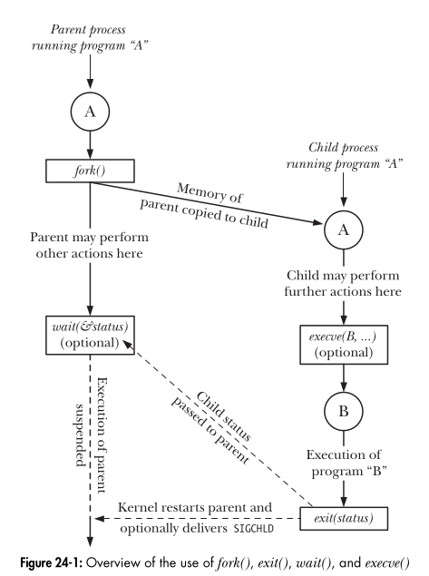
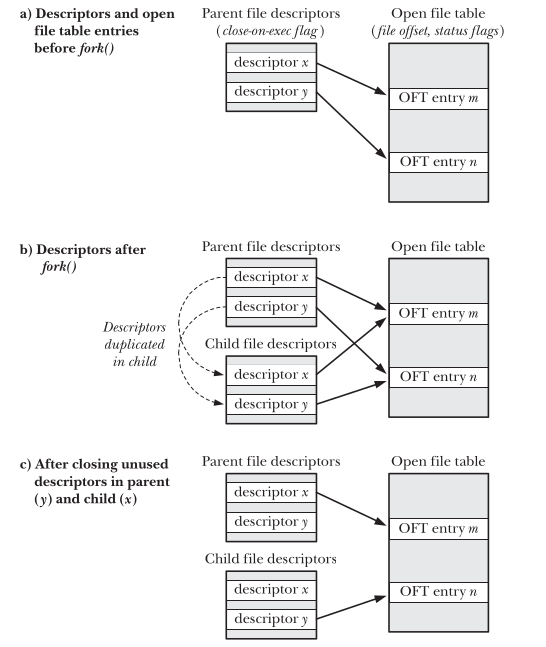
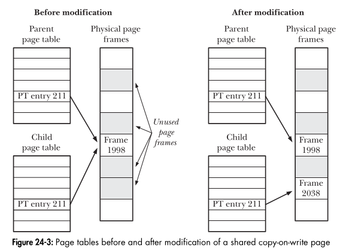

# PROCESS

## 1. Introduction
- A program is a group of instructions that perform a specific task, represented by executable files and stored on a computer's hard drive.
- A process is a program that is being executed and utilizing the system's resources.
## 2. Command Line Arguments
- argc: The number of parameters passed to the main() function.
- argv[]: An array of pointers pointing to the parameters passed to the program.

## 3. Memory layout
- The memory layout of a program is divided into several sections:
    - Code segment: Stores the program's instructions.
    - Data segment: Stores initialized and uninitialized variables.
    - Stack segment: Stores local variables and function call information.
    - Heap segment: Stores dynamically allocated memory.
    - BSS segment: Stores uninitialized variables.
    - Text segment: Stores the program's code.

## 4. Process Creation

- Process creation: Using fork() or clone()
--> Copy `stack`, `data`, `heap` segmentation 
- If you want run program B in process A, you can use fork() and then exec() to run program B.
- Wait for a process: Using wait()
- Normally Termination: Using exit() or _exit()
- Abnormal Termination: Using abort() or raise()
- Process termination: Using kill() or killpg()
```c
#include "tlpi_hdr.h"

static int idata = 111;     /* Allocated in data segment */

int main(int argc, char *argv[]) {
    int istack = 222;       /* Allocated in stack segment */
    pid_t childPid;

    switch (childPid = fork()) {
    case -1:
        errExit("fork");    /* fork() fail */

    case 0:
        idata *= 3;         /* Child process change value variable */
        istack *= 3;
        break;

    default:
        sleep(3);           /* Give child a chance to execute */
        break;
    }

    /* Both parent and child come here */
    printf("PID=%ld %s idata=%d istack=%d\n",
           (long) getpid(),
           (childPid == 0) ? "(child) " : "(parent)",
           idata, istack);

    exit(EXIT_SUCCESS);
}
```
### 4.1 File Sharing Between Parent and Child
When a fork() is performed, the child receives duplicates of all of the parent’s file descriptors. These duplicates are made in the manner of dup(), which means that corresponding descriptors in the parent and the child refer to the same `open file description`.
```c
#include <sys/stat.h>
#include <fcntl.h>
#include <sys/wait.h>
#include <unistd.h>
#include <stdio.h>
#include <stdlib.h>
#include "tlpi_hdr.h"

int main(int argc, char *argv[])
{
    int fd, flags;
    char template[] = "/tmp/testXXXXXX";

    /* Disable buffering of stdout */
    setbuf(stdout, NULL);

    fd = mkstemp(template);
    if (fd == -1)
        errExit("mkstemp");

    /* Display Offset before fork() */
    printf("File offset before fork(): %lld\n",
           (long long) lseek(fd, 0, SEEK_CUR));

    /* Get status flog of file descriptor */
    flags = fcntl(fd, F_GETFL);
    if (flags == -1)
        errExit("fcntl - F_GETFL");

    printf("O_APPEND flag before fork() is: %s\n",
           (flags & O_APPEND) ? "on" : "off");

    switch (fork()) {
    case -1:
        errExit("fork");

    case 0: /* Child: change file offset and status flags */
        /* Change offset to 1000 */
        if (lseek(fd, 1000, SEEK_SET) == -1)
            errExit("lseek");

        /* Get status flags of file descriptor */
        flags = fcntl(fd, F_GETFL);
        if (flags == -1)
            errExit("fcntl - F_GETFL");

        // Turn on O_APPEND
        flags |= O_APPEND;
        if (fcntl(fd, F_SETFL, flags) == -1)
            errExit("fcntl - F_SETFL");

        // Thoát tiến trình con
        _exit(EXIT_SUCCESS);

    default: /* Parent: can see file changes made by child */
        /* Wait for child to finish */
        if (wait(NULL) == -1)
            errExit("wait");

        printf("Child has exited\n");

        /* Check offset of file after fork() */
        printf("File offset in parent: %lld\n",
               (long long) lseek(fd, 0, SEEK_CUR));

        /* Get and display the current O_APPEND flag of the file */
        flags = fcntl(fd, F_GETFL);
        if (flags == -1)
            errExit("fcntl - F_GETFL");
        printf("O_APPEND flag in parent is: %s\n",
               (flags & O_APPEND) ? "on" : "off");

        exit(EXIT_SUCCESS);
    }
}
```




### 4.2 Memory Semantics of `fork()`
when a process calls `fork()`, the kernel creates a new process by duplicating the parent process, including:
```
- Text segment
- Data segment
- Heap segment
- Stack segment
```
--> However, actually performing a simple copy of the parent’s virtual memory pages into the new child process would be `wasteful` for a number of reasons—one being that a fork() is often followed by an
immediate exec(), which replaces the process’s text with a new program and reinitializes the process’s `data`, `heap`, and `stack` segments. Most modern UNIX implementations, including Linux, use t`wo techniques` to avoid such wasteful copying:

#### Share text segment
The `kernel` marks the `text segment` of each process as `read-only`, so that a process can’t modify its own code. This means that `the parent and child can share the same text segment`. The fork() system call creates a text segment for the child by building a set of per-process page-table entries that refer to the same virtual memory page frames already used by the parent.
`Using for segment which not change when run program`


#### Copy-on-write (CoW)
`Using for segment which change when run program`
The kernel uses copy-on-write for the `data`, `heap`, and `stack` segments of the parent process. Initially, the child's page-table entries point to the same read-only physical memory pages as the parent. When either process tries to modify a page, the kernel traps the attempt, duplicates the page, and assigns the copy to the modifying process, updating the child's page-table entry. This allows both processes to modify their private page copies independently.

Example:
- Parent process has 3 memmory pages: Page 1, page 2, page 3.
    - When call fork() which not use Cow:
        - OS copy 3 pages for child process.
        - Child process has 3 pages: page 1, page 2, page 3.
        - `Both child and parent has 6 pages`

    - When call fork() which use Cow:
        - OS not copy 3 pages for child process. Child process point to Page 1, page 2, page 3.
        - If child process edit page 1, OS copy page 1 for child process into Page 1_1.
        - Child process has 3 pages: page 1_1, page 2, page 3
        - `Both child and parent has 4 pages`

## 5. Process Termination
### 5.1 Terminating a Process: _exit() and exit()
### 5.2 Details of Process Termination
### 5.3 Exit Handlers
### 5.4 Interactions Between fork(), stdio Buffers, and _exit()

- wait() is used to wait for the termination of a child process. Returns the process ID of the child process that terminated.
- waitpid(): Waits for the termination of a child process. Returns the process ID of the child process that terminated.
- If one process terminated , the other process will continue to run.
## 6. Monitoring in Child Processes
- Zombie process is a process that has finished execution but still has an entry in the process table.
-> Preventing zombie processes using SIGCHLD, wait(), waitpid()
## 7. Program Execution 
- Orphan process is a process that has finished execution but still has an entry in the process table and its parent process has finished execution.
- Preventing orphan processes using wait(), waitpid()
