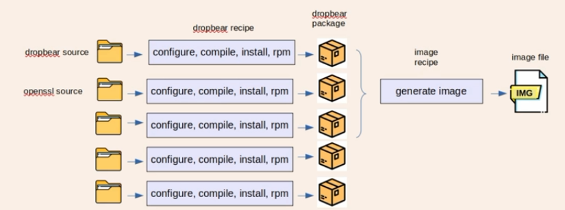
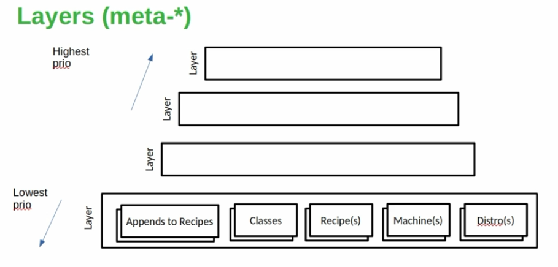
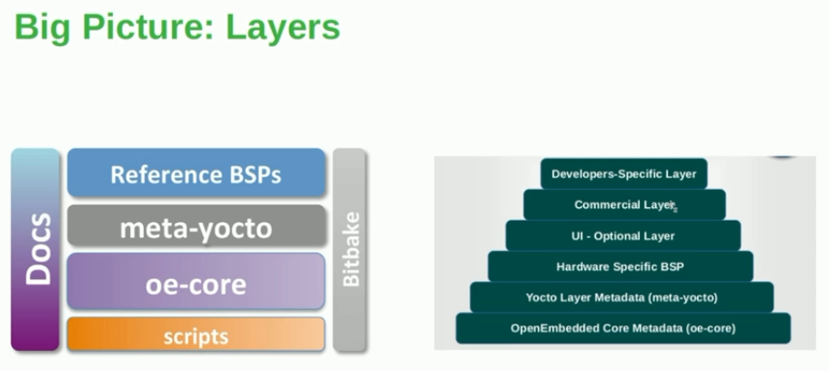

- 
- 
- 

- Add raspberrypi layer:
    - Search meta-.. in `https://layers.openembedded.org/layerindex/branch/master/layers/`
    - `git clone git://git.yoctoproject.org/meta-raspberrypi -b scarthgap`
    - check LAYERDEPENDS
    - find depence layers and install it and add it to `bblayer.conf`

- Create Our Own Layers
    - 