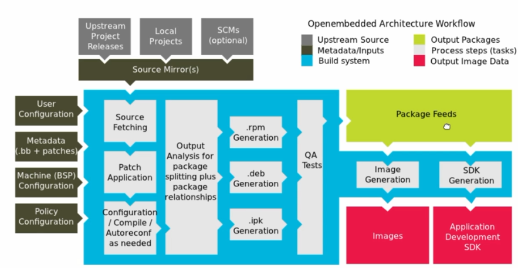

## 1. Architecture

- Source mirror
    - Upstream
    - Local projects
    - SCMs
- Config 
    - **conf/local.conf**
    - **conf/bblayers.conf**
    - meta/your-layer/conf/machine/machine.conf
    - meta/your-layer/conf/distro/distro.conf
    - bitbake.conf
    - meta/your-layer/conf/layer.conf
    - meta/conf/auto.conf
- Source Fetching
- Patch Application
- Configuration/Compile/Autoreconf as needed
## 2. Environment Setup and Downloading Poky Reference Distribution
- Build host package: `sudo apt-get install build-essential chrpath cpio debianutils diffstat file gawk gcc git iputils-ping libacl1 liblz4-tool locales python3 python3-git python3-jinja2 python3-pexpect python3-pip python3-subunit socat texinfo unzip wget xz-utils zstd`
- Use Git to Clone Poky: `git clone git://git.yoctoproject.org/poky -b scarthgap`
- Install extension in VSCode:
    - Code runner
    - Device Tree
    - QML
    - Bash IDE
    - Bitbake
    - vscode-pdf
    - Yocto Project Bitbake
- Find `find . -name "*.txt"`
## 3. Yocto Project Basic Configuration and Examining Poky Source
- Initialize the Build Environment
    - `source oe-init-build-env`